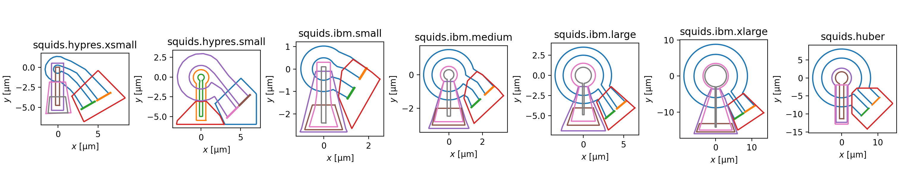
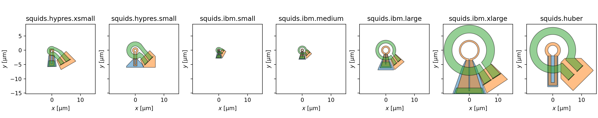

# superscreen-squids

SuperScreen models for scanning SQUID sensors

## `squids.show_all`

Usage:

```python
python -m squids.show_all
```



```python
python -m squids.show_all --draw
```


```python
python -m squids.show_all --draw --same-scale
```



## `squids.mutuals``

Usage:

```python
python -m squids.mutuals
```

Output:

```
squids.hypres.xsmall
--------------------
197.47303402347075 magnetic_flux_quantum / ampere
0.40834142391220707 picohenry
-------------------------------------------------

squids.hypres.small
-------------------
297.8883597846232 magnetic_flux_quantum / ampere
0.6159836334254493 picohenry
------------------------------------------------

squids.ibm.small
----------------
71.89056878633194 magnetic_flux_quantum / ampere
0.14865775152155783 picohenry
------------------------------------------------

squids.ibm.medium
-----------------
160.24919637780062 magnetic_flux_quantum / ampere
0.3313687124588389 picohenry
-------------------------------------------------

squids.ibm.large
----------------
598.6426106111054 magnetic_flux_quantum / ampere
1.2378934533532584 picohenry
------------------------------------------------

squids.ibm.xlarge
-----------------
1572.2038424974053 magnetic_flux_quantum / ampere
3.2510563221980426 picohenry
-------------------------------------------------

squids.huber
------------
890.0607255973631 magnetic_flux_quantum / ampere
1.8404976955768126 picohenry
------------------------------------------------
```